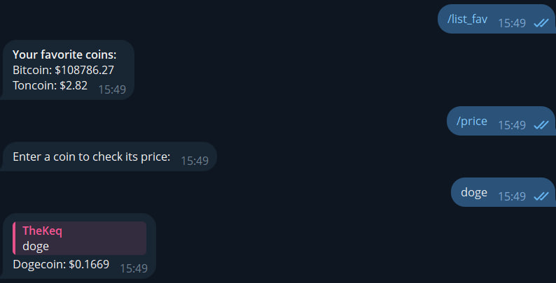

# Telegram Crypto Coin Price

👉 [Read in English](README.md)

Простой Telegram-бот для отслеживания цен криптовалют с помощью  
[CoinMarketCap API](https://coinmarketcap.com/api/)

## Функционал

- 📈 Проверить цену монеты `/price`
- ⭐ Добавить в избранное `/fav`
- 📋 Показать избранные монеты `/list_fav`
- ❌ Удалить из избранного `/remove_fav`
- 🌐 Сменить язык `/language`
- ℹ️ Информация о боте `start`
- 🔍 Inline-запрос по символу монеты

## Пример графика



## Установка

1. Клонируйте репозиторий
    ```bash
    git clone https://github.com/thekeq/crypto_price.git
    cd crypto_price
    ```
2. Установите зависимости:
    ```bash
    pip install -r requirements.txt
    ```
3. Переименуйте `.env.example` -> `.env` и добавьте токены:
    ```env
    BOT_TOKEN=your_telegram_bot_token
    COINCAP_API=your_api_key_here
    ```
4. Для inline_query настройте через bot_father:
    ```
   /setinline
   @вашбот
   Enter a coin symbol (e.g. BTC, ETH)
   ```
5. Запустите бота:
    ```bash
    python main.py
    ```

## Зависимости

- Python 3.10+
- aiogram
- requests
- python-dotenv

---

Если нужны будут подсказки или помощь — обращайтесь!
